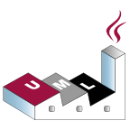
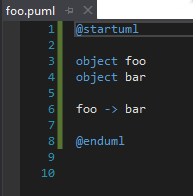
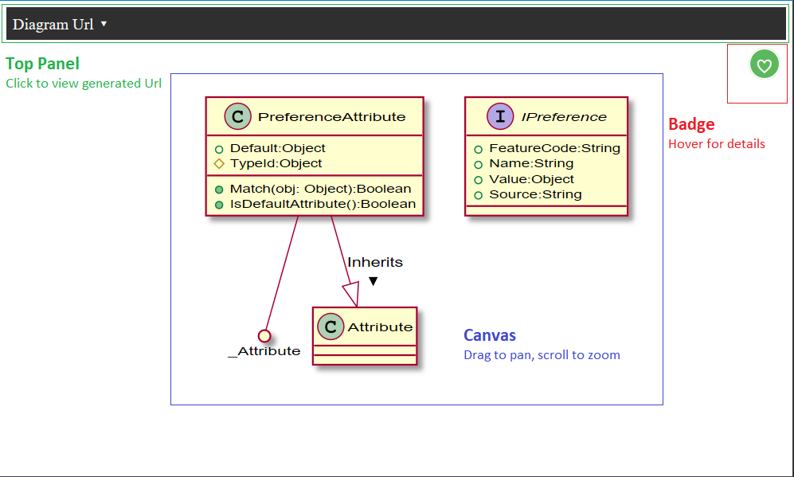

# PlantUml Language Service

Available from [Visual Studio Marketplace](https://marketplace.visualstudio.com/items?itemName=KieranBorsden.PlantUmlLanguageService)

## Description

>_PlantUML is an open-source tool allowing users to create UML diagrams from a plain text language._
>
>**[Wikipedia](https://en.wikipedia.org/wiki/PlantUML)**

Please note that PlantUml is not a functional programming language but a static design DSL specifically for creating diagrams.

PlantUml Language Service provides editor features for the [PlantUml Language](http://plantuml.com/) to Visual Studio (2017). These features are listed and elaborated on below.

**In its default state the language service currently posts your markup to the PlantUml server for rendering in the same manner most PlantUml services provide. Client side rendering via GraphViz will be implemented in a future release.**

##### Credit
+ [PlantUml](https://github.com/plantuml/plantuml) by [arnaudroques](https://github.com/arnaudroques)
+ Built and adapted from [TextMate starter project](https://github.com/madskristensen/TextmateSample) by [Mads Kristensen](https://github.com/madskristensen)
+ Modelled on [Ruby Language Service](https://github.com/madskristensen/RubyLanguageService)
+ Inspired by [Visual Studio Code plugin](https://github.com/qjebbs/vscode-plantuml) by [qjebbs](https://github.com/qjebbs)
+ Grammars by [qjebbs](https://github.com/qjebbs)

#### Features

- [Syntax highlighting](#syntax-highlighting-file-recognition)
- [Auto complete](#auto-complete)
- [Preview diagrams](#preview-diagrams)
- [Language Reference](#language-reference)
- [Preprocessor Friendly](#preprocessor)
- [Embedded Macros](#embedded-macros)
- [Embedded Skins](#embedded-skins)

More to be added over time ...

---
&nbsp;

## Syntax Highlighting & File Recognition

Syntax elements recognised in the [PlantUml grammar definition](src/grammars/plantuml.json) are highlighted accordingly for any of the following file types:

- .plantuml
- .plant
- .uml
- .iuml
- .puml
- .pu

These files are indicated in the Solution Explorer with the following icon: 

&nbsp;

## Auto Complete

Rudimentary auto completion against symbols in the same file is provided. Because no cross-file symbols can be loaded, the language service assumes some user knowledge of the basic PlantUml syntax.

---
&nbsp;

## Preview Diagrams

A context menu option has been added to the code window and solution explorer allowing for diagram generation of the selected/active PlantUml file.

#### Feedback

The preview window will render the diagram and provide feedback in a panel composed of 3 areas:

- **Top Panel** ~ collapsible holds the generated diagram url
- **Canvas** ~ the rendered diagram
- **Badge** ~ the error state indicator

###### Badges
 
|||||
|:----:|:----:|:----:|:----:|
| OK | Warning | Error | Unknown |

###### Urls

If valid, the generated diagram url will be printed to the Output window. For ease of re-use in your documentation it will be printed in both standard html and markdown formats.

To ensure high quality, scalable diagrams, the default url route will resolve to svg format. To use png instead, modify the generated url at this section "http://www.plantuml.com/plantuml/<**svg | png**>/"

&nbsp;

## Language Reference

A dockable Tool Window available under _"View > Other Windows > PlantUml Language Reference"_ links to the latest PlantUml Reference Guide.

&nbsp;

## Preprocessor

The PlantUml Language Service respects all common preprocessor commands, and can use them even if they are nested.

###### !include

While `!inlcude` is usable within the language service, there are caveats:

- makes use of files located inside the active solution directory
- file to include should be specified [NAME].[EXTENSION]:

`!include somefile.extension`

If the file is not in the solution directory, or can otherwsie not be found or loaded, the diagram will render with warnings.

_To avoid warnings, or to use files located elsewhere on your computer, a custom flag has been created: **-P**  (provide the full path)._

`!include -p full/path/to/file`

&nbsp;

## Embedded Macros

Several macros have been embedded for simplicity. They can be imported into your diagram using the `!import` command.

 -- Happy to receive/include more -- 

##### - SysML (`!import SysML`)

Provides short hand commands to create and associate requirements, tests, and expectations:

| Function | Purpose |
| -- | -- |
|`Requirement(name,definition)` | creates a requirement object with detail |
|`BusinessNeed(name,definition)` | creates a business requirement with detail |
|`Generic(name,definition)`| creates a generic entry with detail |
|`TestWithScenario(name,testable)`| (where testable = existing requirement) creates a linked test |
|`VerifyWithTest(testable)`| generates a linked test without scenario against a requirement |
|`Option(requirement,name)`| creates an Options entry and associates with named requirement |

*all functions above accept a 3rd parameter for arrow direction and placement*

| Function | Purpose |
|--|--|
| `Test(name)` | create an unlinked test entry |
| `Scenario(test,testable)` | associate a test with a requirement via scenario |
|`Verify(requirement,testable)` | define acceptance as test verified for requirement |
|`Associate(firstrequirement,secondrequirement)` | create association between 2 requirements |
|`Derive(firstrequirement,secondrequirement)`| indicates requirement is derived from existing need |
| `Expectation(requirement, detail)` | outlines the expectation of a requirement |
|` Criticality(requirement, detail)`| describes the criticality of a requirement |
|`Describe(requirement, detail)` | provides a simple description of a requirement |

![requirements](http://www.plantuml.com/plantuml/svg/hLRRRXCn47qcKlx1P5yIAQs4n0EgcgWte4XG95h12n9oTYU9oQwzs5xIKFNBUE2J-0N6tekzkxcr9QhQr3DpvdXcVEo_l_-SA4sbpfAus-bsr8Bnb4gQ42uqaBjkX-3dZ8QBcHGPZyv5B2HPpfa6bOW557OX8v2vJSLKmqp2gjkvhoEcY49dSArNCH09eQPy5eFluUD4L2uyBESKmPHciPuAhXNx1UJ5Izyg9jyHsHbVhM5GRMilsgTIYcNBgPrp1-gQEXuV4ooZ9kDnkw8jJma_CYOX0Mu3R7c08ZRmJI6JJ34EIXrmWCW4bGkR0cR0GRBGkCPiDjVRc8jKCy6DQogMkE59d45Hk-VO8in3hc3v7l_sDTpg0VdAWy1yS_ORt7oVqmG6PGdDFmJ1R_AoEDVh43YLJFHDmORc5vt466VhTqH6vbCvaT6Oz2iV1_8PDpTTzRrAUaX-VOyF3-z8QK9uPFJJnjOudIebGeODxa-PLDg7LH0A7dah0zBq8S5XG5f-UJ9Q8Zywtp1YveHXXzPchgmFvN21PVZvC0AZNjJRGMAyYKHaqzKOlBvDZNIOk5edqLTJ5jSRQIR32r17rKm6GU5V7ySFeESYsWaS1DzktEJbSrNuERnpoJGBQSpqQZ-cxv9KI5J54BRol00LIZQ1_K17kRizhTjWOy5dX7noqVPa3gsHvOEKIq7ZgDPrANUnjkt9ArGa03no71g4pWh9ka89svDHgN9jEazcypONo3s9E3dztppCy7rXUbx9eYNan6mjdKfKwotQ9fpREEHJRrXO7T-Gl5mkJqoJHwMoDSrrvwiXlOyWv4lXOwavgNeQnstJFAHHPB_Gs54c8zBBUeFY4cv5DsR6DjQystf1uD1wgEMstyZOMDq050la_g1AU32sbXsb_fYsz3VVJLtqQ-MkosSGb6DPFIIwdMV5zL8JjdLnNa_RJBiT_F65x8qGGvQgB27uT844GsgLFADoQ0tCl2q5cijZpZ3IM3doWuXDQJWmyEuYDiZeWAi5SvigZxAkHQ7CChdKIMmN_IlCM5IM6k5NP9vx-1U7IKykyJ66wuq1z_ESO0tm2VyF)

##### - Entities (`!import Entities`)

Provides stereotypes for Entity Relationship Mapping (see examples)

##### - UseCase (`!import UseCase`)

Provides stereotypes for UseCase diagrams (see examples)

&nbsp;

## Embedded Skins

Several skins/themes have been embedded for simplicity. They can be imported into your diagram using the `!theme` command.

 -- Happy to receive/include more -- please see [resource](src/resources/base.skin) for a base to work with

- blue (`!theme blue`)
- napkin (`!theme napkin`)
- trans [transparent] (`!theme trans`)

---
&nbsp;

## Future

- Reverse Dll to PlantUml Class diagrams
- Document Generator
- Code Generator
- Simple Intellisense / Auto Complete for core keywords

**To help realize these or to contribute please contact me.**
